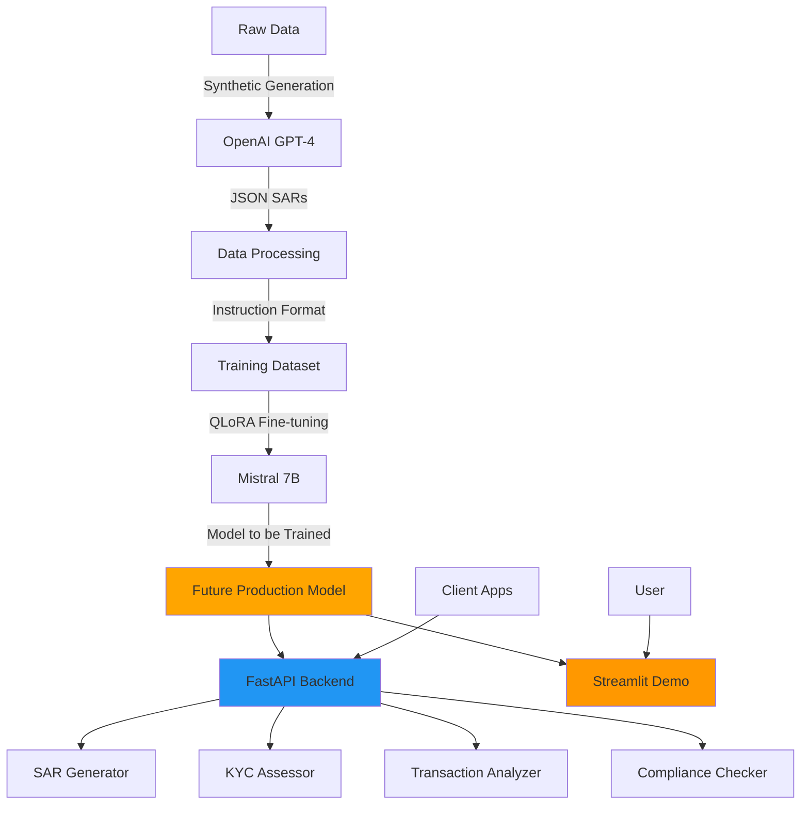

# FinCrime-LLM

[](https://www.python.org/downloads/)
[](LICENSE)
[](https://github.com/psf/black)
[](docs/CONTRIBUTING.md)

**A Large Language Model (LLM) Project For Financial Crime Detection in African Markets**

This project aims to fine-tune the Mistral 7B model to generate Suspicious Activity Reports (SARs), KYC assessments, and transaction analysis tailored to African financial contexts. Currently in active development.

## Project Status

**Work in Progress**: This model is currently under development. Training and deployment have not yet been completed. The codebase provides the infrastructure and workflows needed for:
- Synthetic data generation
- Model fine-tuning with QLoRA
- API and demo interfaces (ready for when the model is trained)
- Testing and evaluation frameworks

## Planned Features

- **SAR Generation**: Will automatically generate comprehensive Suspicious Activity Reports
- **KYC Assessment**: Will perform risk-based customer due diligence
- **Transaction Analysis**: Will detect suspicious patterns and red flags
- **QLoRA Training**: Efficient 4-bit quantized training on consumer GPUs
- **WandB Integration**: Track experiments and model performance
- **Compliance-First**: Building with regulatory requirements in mind

## Planned Architecture



## Project Structure

```
FinCrime-LLM/
├── api/                  # FastAPI backend
│   ├── routers/         # API endpoints (SAR, KYC, Transaction, Compliance)
│   ├── models/          # Pydantic schemas
│   └── utils/           # Auth, logging utilities
├── data/
│   ├── raw/             # Raw financial crime datasets
│   ├── processed/       # Cleaned and preprocessed data
│   ├── datasets/        # Training/validation/test splits
│   └── scripts/         # Data generation & preparation
├── training/            # Training scripts and configs
│   ├── configs/        # YAML configuration files
│   └── train_*.py      # Training scripts
├── inference/           # Inference utilities
│   ├── generate.py     # Generation functions
│   ├── load_model.py   # Model loading
│   └── prompts.py      # Prompt templates
├── demo/               # Streamlit demo app
├── notebooks/          # Jupyter notebooks (5 tutorials)
├── tests/              # Comprehensive test suite
├── docs/               # Full documentation
└── models/
    ├── checkpoints/    # Model checkpoints during training
    └── final/          # Final trained models
```

## Quick Start

These instructions guide you through the development workflow for training and testing the model.

### Installation

```bash
# Clone the repository
git clone https://github.com/PatrickAttankurugu/FinCrime-LLM.git
cd FinCrime-LLM

# Create virtual environment
python -m venv venv
source venv/bin/activate  # On Windows: venv\Scripts\activate

# Install dependencies
pip install -r requirements.txt

# Set up environment variables
cp .env.example .env
# Edit .env with your API keys
```

### 1. Generate Synthetic Training Data

```bash
# Generate 100 synthetic SARs using GPT-4
python data/scripts/generate_synthetic_sars.py \
    --count 100 \
    --output data/raw/synthetic_sars.jsonl \
    --model gpt-4
```

### 2. Prepare Training Data

```bash
# Process raw SARs into instruction-tuning format
python data/scripts/prepare_sar_data.py \
    --input data/raw/synthetic_sars.jsonl \
    --output data/processed/ \
    --format alpaca \
    --include-analysis
```

### 3. Train the Model

```bash
# Fine-tune Mistral 7B with QLoRA
python training/train_sar.py \
    --data data/processed/sar_dataset_alpaca \
    --output models/sar-mistral-7b \
    --epochs 3 \
    --batch-size 4 \
    --lora-r 16 \
    --lora-alpha 32
```

### 4. Run Inference (After Training)

```bash
# Generate a SAR (once model is trained)
python inference/generate.py \
    --model models/sar-mistral-7b/final \
    --task sar \
    --input '{"country": "Ghana", "subject_name": "John Doe", "transactions": "..."}'
```

### 5. Start the API (After Training)

```bash
# Launch FastAPI server
python api/main.py

# Or using uvicorn directly
uvicorn api.main:app --host 0.0.0.0 --port 8000 --reload
```

API will be available at:
- OpenAPI docs: http://localhost:8000/docs
- Health check: http://localhost:8000/health

### 6. Run the Demo (After Training)

```bash
# Launch Streamlit demo (once model is trained)
cd demo
streamlit run streamlit_app.py
```

## Docker Deployment

```bash
# Build and run with Docker Compose
docker-compose up -d

# Access API at http://localhost:8000
# Access demo at http://localhost:8501
```

## Documentation

- [Installation Guide](docs/INSTALL.md) - Detailed setup for Linux/Mac/Windows
- [Training Guide](docs/TRAINING.md) - Hyperparameter tuning and best practices
- [API Documentation](docs/API.md) - Complete endpoint reference
- [Dataset Guide](docs/DATASET.md) - Data format and schema
- [Contributing](docs/CONTRIBUTING.md) - How to contribute

## Training Approach

This project uses:

- **Base Model**: [Mistral 7B](https://huggingface.co/mistralai/Mistral-7B-v0.1)
- **Fine-tuning Method**: QLoRA (4-bit quantization + LoRA adapters)
- **LoRA Config**: r=16, alpha=32, target_modules=[q_proj, k_proj, v_proj, o_proj, gate_proj, up_proj, down_proj]
- **Training Data**: Synthetic SARs + Real financial crime examples (African contexts)
- **Optimization**: BF16 mixed precision, gradient checkpointing
- **Framework**: HuggingFace Transformers + PEFT + TRL

## Intended Use Cases

Once the model is trained, it will support the following use cases:

### Anti-Money Laundering

```python
from inference.load_model import load_fincrime_model
from inference.generate import generate_sar

# After training is complete
model, tokenizer = load_fincrime_model("models/sar-mistral-7b/final")

transaction_data = {
    "country": "Ghana",
    "subject_name": "ABC Trading Ltd",
    "institution": "First Atlantic Bank",
    "total_amount": 500000,
    "currency": "GHS",
    "transactions": "15 cash deposits under 10,000 GHS over 2 weeks",
    "summary": "Structuring pattern detected"
}

sar = generate_sar(model, tokenizer, transaction_data)
print(sar)
```

### KYC Risk Assessment

```python
from inference.generate import generate_kyc_assessment

customer_data = {
    "name": "Jane Smith",
    "customer_type": "Individual",
    "country": "Kenya",
    "occupation": "Import/Export Business",
    "source_of_funds": "Business Revenue"
}

assessment = generate_kyc_assessment(model, tokenizer, customer_data)
print(assessment)
```

### Transaction Analysis

```python
from inference.generate import generate_transaction_analysis

transaction_data = {
    "transactions": "Multiple rapid in-and-out transactions, high velocity",
    "description": "Account opened recently, unusual activity for customer profile"
}

analysis = generate_transaction_analysis(model, tokenizer, transaction_data)
print(analysis)
```

## Testing

```bash
# Run all tests
pytest tests/ -v

# Run specific test suite
pytest tests/test_api.py -v

# Run with coverage
pytest tests/ --cov=. --cov-report=html
```

## Planned Evaluation

Once training is complete, the model will be evaluated on:
- 500+ manually labeled test SARs
- Cross-validation against expert compliance officers
- Testing across 10 African countries
- Evaluation on 8 major financial crime typologies

## African Financial Crime Coverage

**Countries**: Ghana, Nigeria, Kenya, South Africa, Tanzania, Uganda, Rwanda, Zambia, Botswana, Ethiopia

**Crime Typologies**:
- Money Laundering
- Terrorist Financing
- Trade-Based Money Laundering
- Fraud & Cybercrime
- Corruption & Bribery
- Mobile Money Fraud
- Cryptocurrency Scams
- Ponzi Schemes
- Shell Company Abuse
- Invoice Manipulation

**Regulatory Frameworks**:
- GIABA (Inter-Governmental Action Group against Money Laundering in West Africa)
- ESAAMLG (Eastern and Southern Africa Anti-Money Laundering Group)
- National regulations (FIC Act, AML Acts, CBN guidelines, etc.)

## Regulatory Compliance

This model is designed to **assist** with compliance but should not be used as the sole decision-making tool. Always:

- Have human oversight for critical decisions
- Regularly audit model outputs
- Stay updated with regulatory changes
- Consult legal experts for regulatory interpretation
- Maintain comprehensive audit trails

## Contributing

We welcome contributions! Please see [CONTRIBUTING.md](docs/CONTRIBUTING.md) for guidelines.

## License

This project is licensed under the Apache License 2.0 - see the [LICENSE](LICENSE) file for details.

## Disclaimer

This project is currently under active development and the model has not yet been trained or deployed. Once completed, the model will be intended for research and assistance purposes only. Financial institutions must ensure compliance with all applicable laws and regulations. Any future model outputs should be reviewed by qualified compliance professionals.

## Contact & Support

- Report issues: [GitHub Issues](https://github.com/PatrickAttankurugu/FinCrime-LLM/issues)
- Discussions: [GitHub Discussions](https://github.com/PatrickAttankurugu/FinCrime-LLM/discussions)
- Email: patricka.azuma@gmail.com

## Acknowledgments

- [Mistral AI](https://mistral.ai/) for the base model
- [HuggingFace](https://huggingface.co/) for the excellent ML ecosystem
- African financial regulatory bodies for guidance
- Contributing institutions and researchers

---

**If you find this project useful, please consider giving it a star!**

